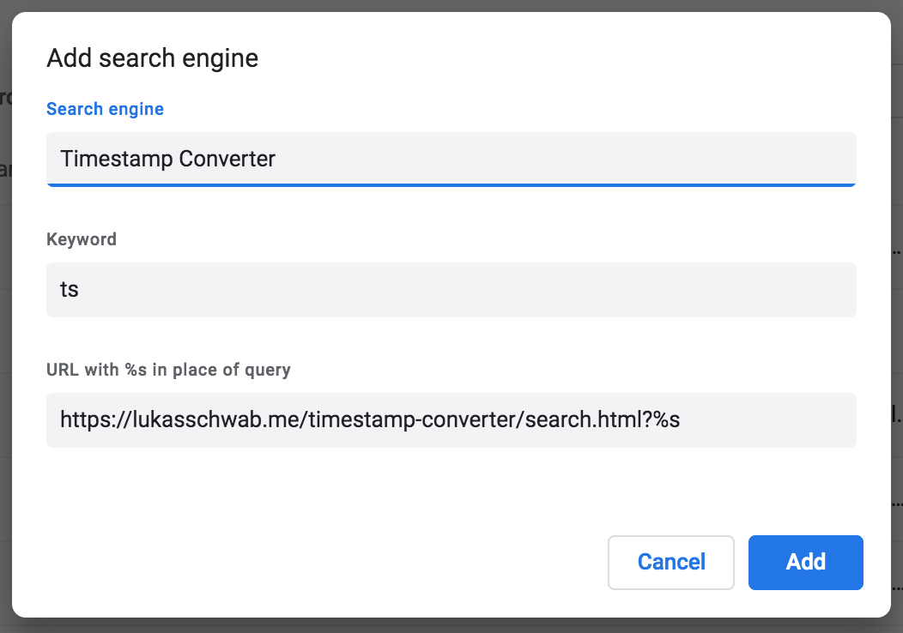

# timestamp-converter

Some simple timestamp utilities.

+ Unix timestamps (milliseconds and seconds)
+ ISO 8601 timestamps
+ Mongo ID timestamps

## Search

`timestamp-converter` provides a naîve router for [defining a Chrome search engine.](https://support.google.com/chrome/answer/95426#edit)

To add this search engine to Chrome, visit `chrome://settings/searchEngines`.

1. Click `Add`, and input the following values:
    + **Search Engine:** Timestamp Converter
    + **Keyword:** ts
    + **Query URL:** `https://lukasschwab.me/timestamp-converter/?%s`   
    

2. Click `Add`.

After following these steps, you should be able to type `ts` in the omnibox, hit `Tab`, and then input a timestamp in one of the three supported input forms:

### Routing

+ If the search query is empty, you'll be redirected to the Unix timestamp converter by default.
+ If the search query is all digits, you'll be redirected to the Unix timestamp converter.
+ If the search query can be parsed by the Javascript `new Date()` constructor, you'll be redirected to the ISO timestamp converter.
+ Otherwise, you'll be redirected to the Mongo ID converter.
